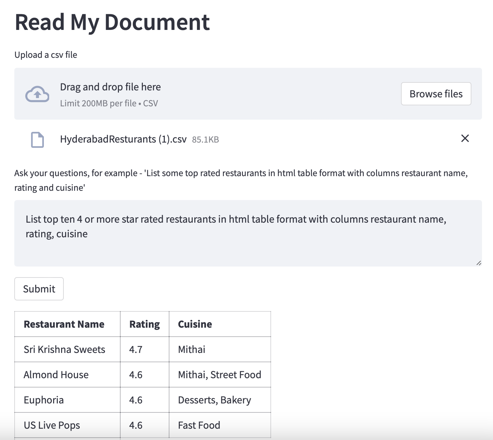

# Read My Documents

An LLM Application to ask questions about your uploaded documents.

## Initial Setup

2. Create a virtual environment
```
python3 -m venv .venv
```

3. Activate environment
```
source .venv/bin/activate
```

4. Install Dependencies

```
pip install -r requirements.txt
```

5. If using, Open AI APIs, Add your secret key

```
export OPENAI_API_KEY="your key"
```
[Open AI API](https://platform.openai.com/account/api-keys)

6. Run 
```
streamlit run main.py
```
Access the app: http://localhost:8501



## Roadmap

* Add support for text, doc, pdf and images

## Project Architecture


## Llama Embeding Model


[Download Here ](https://huggingface.co/Pi3141/alpaca-7B-ggml/resolve/main/ggml-model-q4_0.bin)
