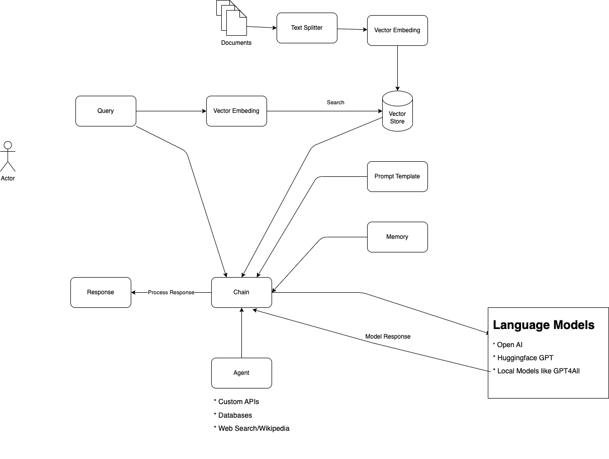

# Read My Documents

Read-My-Document is a Langchain-based application that allows you to upload CSV, PDF, DOCX, and TXT files and ask questions related to the content of these documents. The application will search through the document and interact with Language Learning Models (LLMs) to generate a response to your query.

## Features

* Supports multiple file formats: CSV, PDF, DOCX, TXT.
* Utilizes advanced Language Learning Models (LLMs) for query processing.
* Allows users to select between different models, including OpenAI and GPT4All.
* GPT4All, a ggml model, works locally on CPUs. **Good for private documents. Applicaiton doesn't send document content to any api for embeding or generating response**.

## Initial Setup

**Create a virtual environment**
```
python3 -m venv .venv
```

**Activate environment**
```
source .venv/bin/activate
```

**Install Dependencies**

```
pip install -r requirements.txt
```

**If using, Open AI APIs, Add your secret key**

```
export OPENAI_API_KEY="your key" 
```

**Get your Open API Keys**

[Open AI API](https://platform.openai.com/account/api-keys)

**Running App**
```
streamlit run main.py
```

**With Docker**

```
docker build -t MyDocumentQA .
```

```
docker run -p 8501:8501 MyDocumentQA
```

**Access**

Link: http://localhost:8501


## Roadmap

* Add support for text, doc, pdf and images

## Project Architecture



## Local Models

* GPT4All - [Download Here](https://gpt4all.io/models/ggml-gpt4all-j-v1.3-groovy.bin)
* Llama - [Download Here](https://huggingface.co/Pi3141/alpaca-7B-ggml/resolve/main/ggml-model-q4_0.bin)

## Contributing
We welcome contributions to this project. To contribute:

Fork this repository.
Create your feature branch (git checkout -b feature/fooBar).
Commit your changes (git commit -am 'Add some fooBar').
Push to the branch (git push origin feature/fooBar).
Create a new Pull Request.

## License
This project is licensed as free for commercial use.

## Contact Information
For more information or if you have any questions, you can reach out to us:

- Email: ranjeetkumar692@gmail.com
- Twitter: [@ranjeet692](https://twitter.com/ranjeet692)
- LinkedIn: [Ranjeet Kumar](https://www.linkedin.com/in/ranjeet-kumar-456a7a61)